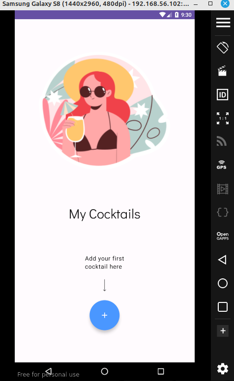
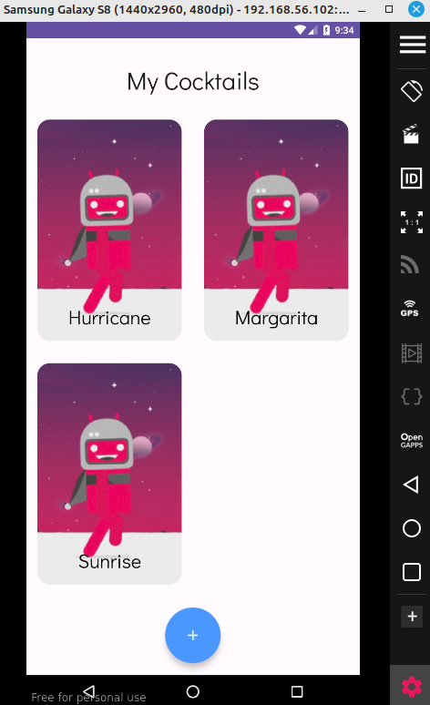
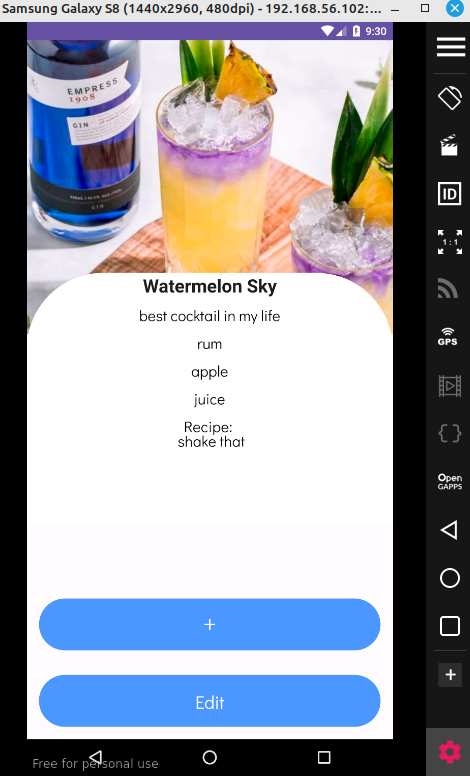
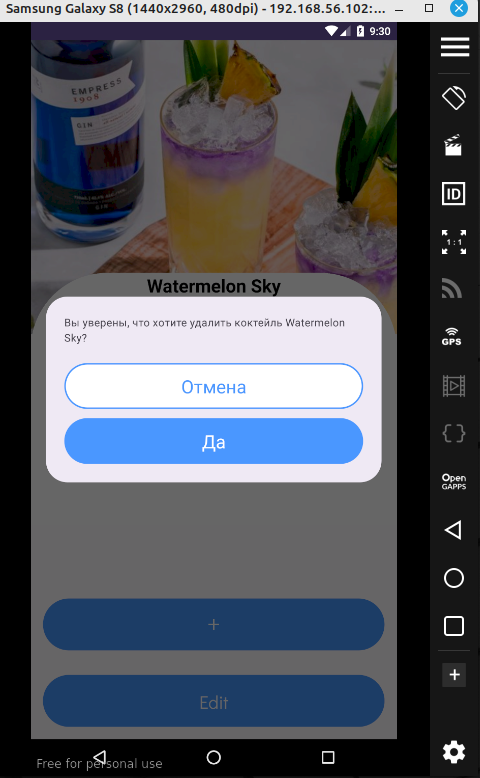
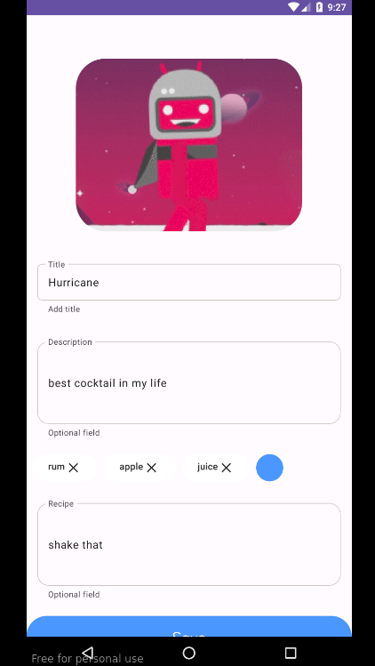
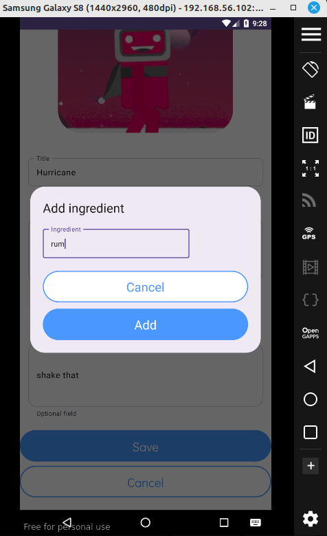

# CocktailBar

## Что это за приложение?

Приложение выполнено в рамках одного дня на "Surf Summer Study Jam 2023" компании "Surf"

*Cocktail Bar -  это приложение, которое позволяет пользователям создавать и сохранять свои любимые коктейли в одном месте. Благодаря этому приложению, пользователи смогут добавлять информацию о каждом коктейле, такую как название, описание, список ингредиентов и рецепт его приготовления. Cocktail Bar - это платформа для хранения информации о ваших любимых напитках, а также для обмена рецептами и впечатлениями с друзьями!*

## Основной функционал:
Создание коктейлей: Пользователи могут  создавать новые записи о своих любимых коктейлях. Возможность загрузки картинки для каждого коктейля.
Детализированная информация: Для каждого созданного пользователем коктейля можно указать подробное описание со всеми необходимыми деталями: название, рецепт, а также список всех используемых ингредиентов.
Сохранение: Каждый созданный пользователем коктейль сохраняется в личном списке, доступном только для него. 
Удаление: Каждый созданный пользователем коктейль есть возможность и удалить 

## UI скриншоты

|                   |                                                                   |                                                                |
|-------------------|-------------------------------------------------------------------|----------------------------------------------------------------|
| Main screen       |        |                                                                |
| MyCocktail screen |  |                                                                |
| Detail screen     |     |  |
| Add screen        |         |     |
| gif               |              |                                                                |

## Использованные технологии

1. Jetpack Compose
2. Navigation
3. Room database
4. DI Koin
5. Coil
6. ViewModel and Lifecycle components

## Сборка и запуск

Сборка и запуск средствами Android Studio без особенностей.
minSdk 26, targetSdk 34

## Известные проблемы
не всегда отображается картинка в detail screen

